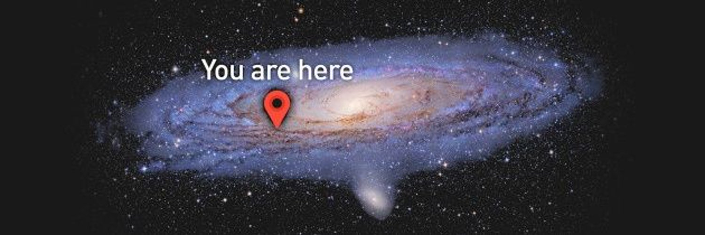
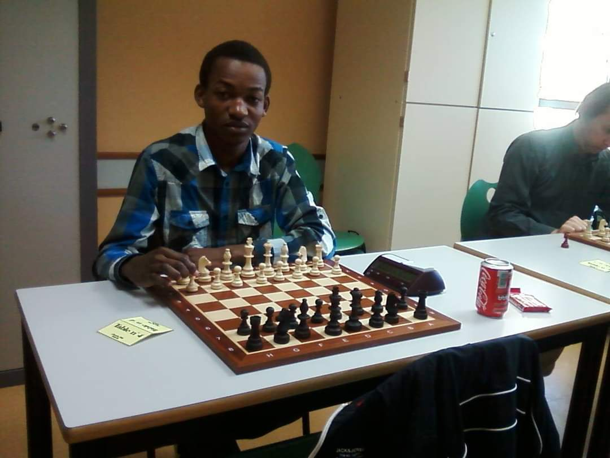
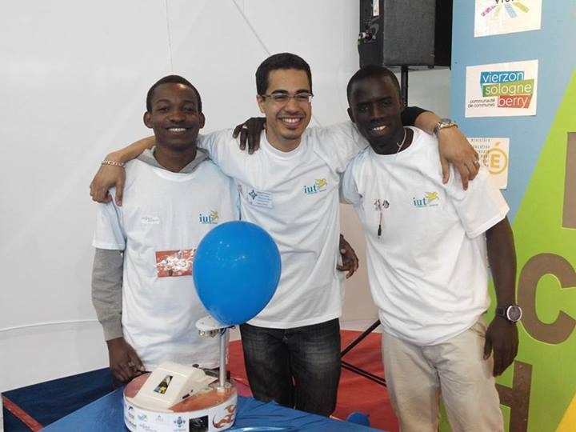
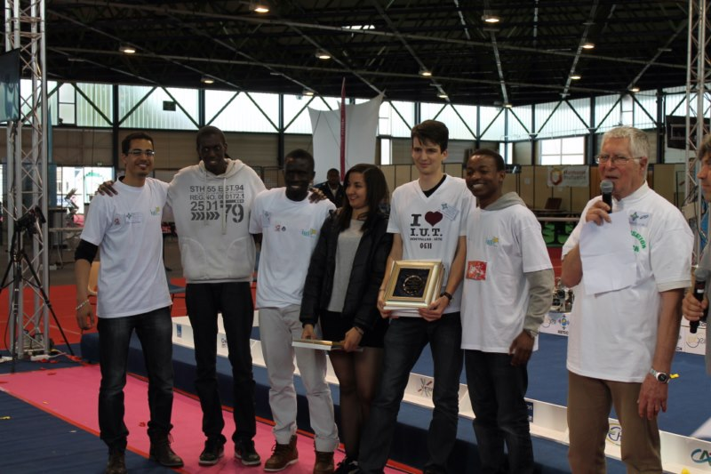
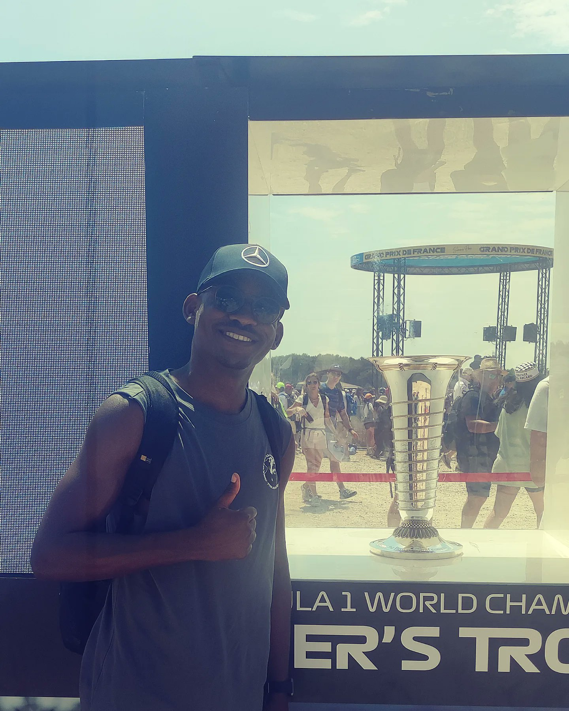
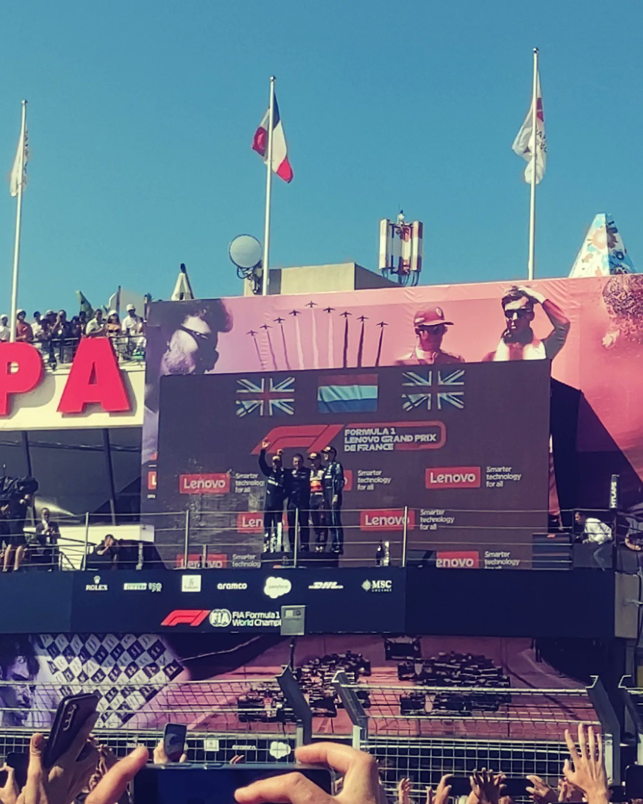
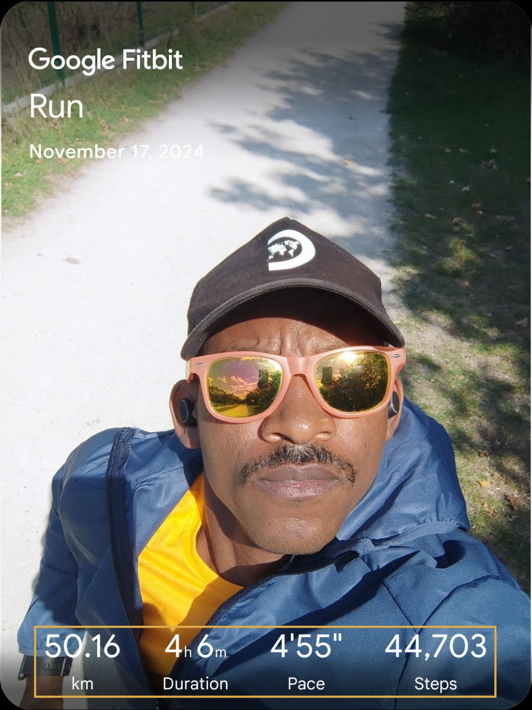

#### Hello World! 

I am Afonso Diela, an **Edge AI/ML and Computer Vision Engineer** based in Paris, with over 5 years of experience delivering software solutions in the automotive industry. I specialize in designing, optimizing, and deploying deep learning models on embedded and edge devices for real-world applications across multiple industries.

I hold a **Master’s in Electrical Engineering and Industrial Computing** from [ENSEA](https://www.ensea.fr/) (France), with a focus on Embedded Systems. Additionally, I completed specialized training in self-driving technologies from the **[University of Toronto](https://drive.google.com/file/d/1wlgQ-GwoIgOL2Vow7FwiiunkZ4DbRg_c/view?usp=sharing)** and am a Certified Data Scientist by [IBM](https://drive.google.com/file/d/1cMWIpsucaRy8IGRQFemFAFhurRcslfLF/view?usp=sharing).

My mission is to leverage my deep expertise in Edge AI, embedded systems, and computer vision to deliver efficient, scalable solutions—from research to production—ensuring real-time performance and measurable impact.

  <a href="/portfolio/" class="btn btn--primary" style="margin: 0 10px;">Portfolio</a>
  <a href="/services/" class="btn btn--primary" style="margin: 0 10px;">Expertise</a>

## Interests

### Passion for Physics, Cognitive Science and AI

- **Physics**

  

    
 <a href="https://en.wikipedia.org/wiki/Milky_Way"> Our Beautiful Galaxy</a>

  

From a young age, I was fascinated by the underlying physics of everything around me—how the real world works. This curiosity led me to explore how we can model, simulate, and understand complex systems that interact with the physical world, a journey that ultimately brought me to engineering.

- **Chess** ♟

  

    
 <a href="https://www.echecsplus.fr">Echecs Plus Club - ~2013, Cherbourg </a>

  

<!--  -->

I discovered chess in high school, which sparked my interest in strategic thinking and problem-solving. This passion naturally led me into the world of AI, especially after learning about the historic match between [Deep Blue and Garry Kasparov](https://en.wikipedia.org/wiki/Deep_Blue_versus_Garry_Kasparov), which showcased the potential of AI in complex decision-making.

- **Robotics**

<link href="https://cdnjs.cloudflare.com/ajax/libs/lightbox2/2.11.3/css/lightbox.min.css" rel="stylesheet">

  

    <iframe width="100%" height="50%" src="https://www.youtube.com/embed/m303vg0Jp2Q" frameborder="0" allowfullscreen></iframe>
    
Final round

  

  

    <a href="../assets/images/ubuntu-team_0.jpg" data-lightbox="gallery" data-title="Robotics Team Image 1">
      
      
UBUNTU Team: Myself, J. Arné, A. Konaté

    </a>
    <a href="../assets/images/ubuntu-team_1.jpg" data-lightbox="gallery" data-title="Robotics Team Image 2">
      
      
Prize Ceremony - 4th of 26.

    </a>
  

My journey into robotics began at the [France National Robotics Championship](https://www-festivalrobotiquecachan-fr.translate.goog/?_x_tr_sl=fr&_x_tr_tl=en&_x_tr_hl=fr&_x_tr_pto=wapp), where my team and I built a fully [autonomous robot](https://github.com/afondiel/computer-science-notebook/blob/master/core/ai-ml/docs/geii/UBUNTU-Vierzon-Cherbourg-2014-Julien-ARNE-en.pdf) using [odometry](https://modernrobotics.northwestern.edu/nu-gm-book-resource/13-4-odometry/). This experience sparked my passion for AI and robotics, driving me to explore and develop innovative solutions in the field.

- **Languages**

I am multilingual, speaking more than three languages, which enhances my ability to collaborate in diverse, international environments.

### Automotive & Motorsport

<link href="https://cdnjs.cloudflare.com/ajax/libs/lightbox2/2.11.3/css/lightbox.min.css" rel="stylesheet">

  

    
    
  

  
F1 <a href="https://www.formula1.com/en/racing/2022/france">GRAND PRIX DE FRANCE 2022</a> at <a href="https://www.circuitpaulricard.com/en/events/formula-1-french-grand-prix-22-24-july-en">Paul Ricard, Le Castellet</a>

My passion for the automotive industry and motorsports drives my work in developing advanced AI solutions for smart mobility and autonomous vehicles.

### Ultrarunner ⚡️ 

<quote><small>"No Human Is Limited." ~ <a href="https://fr.wikipedia.org/wiki/Eliud_Kipchoge">Eliud Kipchoge</a></small></quote>

  

    
  

<!--  -->

Endurance sports, like ultrarunning, swimming have taught me resilience and perseverance, skills that are invaluable in solving complex problems in both personal and professional life.

## Miscellaneous

- **[2016 March]** [Authored a technical survey on "Strong AI" (AGI) for my undergrad year at ENSEA: prediction, reflecting on the advancements and future of artificial intelligence.](https://github.com/afondiel/computer-science-notebook/blob/master/core/ai-ml/docs/strong-ai-technical-report-undergrad-ensea-2016/strong_ai_technical_survey_undergrads_ensea_2016_report_last_en_deepl_translate_v0.pdf)
  - [Presentation - Technical Survey on Strong AI "AGI" (Afonso Diela)](https://github.com/afondiel/computer-science-notebook/blob/master/core/ai-ml/docs/strong-ai-technical-report-undergrad-ensea-2016/strong_ai_technical_survey_undergrads_ensea_2016_slides_last_en.pdf)
- **[2014 July]** [Technical Report UBUNTU from the 2014 French National Robotics Championship (GEII)](https://github.com/afondiel/computer-science-notebook/blob/master/core/ai-ml/docs/geii/UBUNTU-Vierzon-Cherbourg-2014-Julien-ARNE-en.pdf)
